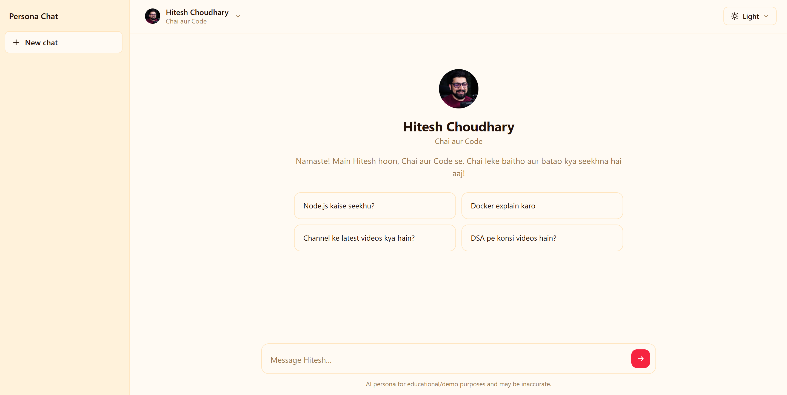
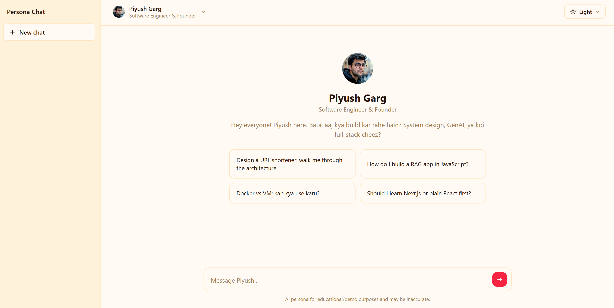

# Persona Chat — Frontend

A minimal, ChatGPT-style chat interface for talking to two personas —
**Hitesh Choudhary** and **Piyush Garg** — with a dropdown to switch between
them and a light/dark theme toggle.

This repo contains **only the frontend**. It is not wired up to a real LLM
yet — see "Connecting a backend" below.

## Stack

- React 18
- Vite
- Plain CSS (CSS variables for theming, no UI framework)

## Getting started

```bash
npm install# Persona Chat — AI Educator Roleplay App

> 🔗 **Live demo:** [persona-ai-nu-teal.vercel.app](https://persona-ai-nu-teal.vercel.app)
>
> ⏳ **Note:** The backend is hosted on Render's free tier, which spins down after periods of inactivity. If the app has been idle for a while, your **first message may take 20–30 seconds** to get a reply while the server wakes up. Subsequent messages will be fast. This is expected behavior, not a bug.

A full-stack web app where you can chat with AI personas of two Indian tech educators — **Hitesh Choudhary** (Chai aur Code) and **Piyush Garg** (Software Engineer & Founder) — each speaking in their own distinct Hinglish style, tone, and teaching approach, built entirely through prompt engineering.




---

## Tech Stack

| Layer | Technology |
|---|---|
| Frontend | React 18 + Vite |
| Backend | Node.js + Express |
| LLM | Google Gemini (`gemini-3.5-flash`), via OpenAI SDK compatibility layer |
| Hosting | Vercel (frontend) + Render (backend) |
| Styling | Plain CSS with light/dark theme variables |

---

## Project Structure

```
Persona_AI/
├── BACKEND/
│   ├── server.js              # Express app, /api/chat route
│   ├── personas/
│   │   ├── index.js            # Persona registry
│   │   ├── hitesh.js           # Hitesh's system prompt
│   │   └── piyush.js           # Piyush's system prompt
│   ├── package.json
│   └── .env                   # GEMINI_API_KEY (not committed)
│
└── FRONTEND/
    ├── src/
    │   ├── App.jsx              # App state, handleSend, API calls
    │   ├── data/personas.js     # Persona display metadata
    │   └── components/
    │       ├── ChatWindow.jsx    # Chat UI, message rendering, typing indicator
    │       ├── Sidebar.jsx
    │       ├── PersonaDropdown.jsx
    │       ├── ThemeDropdown.jsx
    │       └── PersonaAvatar.jsx
    ├── index.html
    └── package.json
```

---

## Setup & Run Instructions (Local Development)

### Prerequisites
- Node.js (v18 or later)
- A Google Gemini API key from [Google AI Studio](https://aistudio.google.com/apikey) — **must** start with `AIza...` (Vertex AI-style keys will not work with this setup)

### 1. Clone the repo
```bash
git clone https://github.com/vanshbaranwal/Persona_AI.git
cd Persona_AI
```

### 2. Backend setup
```bash
cd BACKEND
npm install
```

Create a `.env` file in `BACKEND/` with:
```
GEMINI_API_KEY=your_actual_api_key_here
PORT=3000
```

Run the backend:
```bash
npm run dev
```
You should see:
```
Persona chat backend running at http://localhost:3000
```

Verify it's working by visiting `http://localhost:3000/api/health` — it should return `{"status":"ok"}`.

### 3. Frontend setup
```bash
cd ../FRONTEND
npm install
npm run dev
```

Open the printed local URL (usually `http://localhost:5173`).

> Make sure the backend is running before testing the frontend — the app calls a live backend URL for chat responses.

### 4. Build for production
```bash
npm run build
npm run preview
```

---

## Documentation

### 1. How the Persona Data Was Collected and Prepared

The persona system prompts weren't hand-written from scratch — they were built from **real source material**:

- I watched full live-stream sessions from both educators' YouTube channels and **manually transcribed** their speech patterns, catchphrases, teaching style, and typical explanations.
- From these transcripts, I extracted recurring linguistic patterns: their specific Hindi/English (Hinglish) mixing ratio, filler phrases, tone (casual vs. structured), and how they explain technical concepts step by step.
- This raw analysis was then distilled into structured system prompts capturing each persona's voice — rather than generic "act like X" instructions, the prompts encode actual observed speech and teaching patterns.

### 2. Prompt Engineering Strategy

Each persona's system prompt was built using a layered strategy combining multiple prompting techniques:

- **Role-based prompting** — the model is explicitly instructed to roleplay as a specific named persona with defined identity, background, and voice, not just "answer like a teacher."
- **System-level instructions** — tone, language ratio, catchphrases, and behavioral rules (e.g., how formal/informal to be, what topics to redirect) are set at the system prompt level so they persist across the whole conversation, not just the first reply.
- **Chain-of-thought guidance** — prompts include instructions on *how* each persona breaks down and explains a technical concept step-by-step, mirroring their real teaching structure rather than just giving a final answer.
- **Few-shot examples** — the prompts include actual example Q&A pairs (drawn from the transcripts) showing the model concrete examples of the persona's real response style, which anchors tone and phrasing far more reliably than description alone.

This layered approach — role definition → behavioral rules → reasoning style → concrete examples — is what makes each persona feel consistent rather than generic.

### 3. Context Management Approach

The backend is intentionally **stateless**:

- Each request to `/api/chat` includes the full conversation history for that persona, sent fresh from the frontend (`{ persona, message, history }`).
- The server rebuilds the message list per request: `[system prompt for persona] + [prior conversation turns] + [new user message]` — it does not store any conversation state server-side.
- This design means the server can scale cleanly across multiple users and personas without state collisions, since nothing is shared globally between requests.
- On the frontend, each persona's conversation is stored separately (`conversations.hitesh`, `conversations.piyush`), so switching personas mid-session preserves each chat independently without mixing context.

### 4. Sample Conversations

**Hitesh Choudhary persona:**


**Piyush Garg persona:**


---

## Disclaimer

This project is for educational and demonstration purposes. The AI personas are inspired by public educators' teaching styles but are not affiliated with or endorsed by them, and responses may be inaccurate.

npm run dev
```

Then open the printed local URL (usually `http://localhost:5173`).

To build for production:

```bash
npm run build
npm run preview
```

## Project structure

```
src/
  data/personas.js         # persona metadata: name, tagline, suggestions
  components/
    Sidebar.jsx             # left rail: brand + "New chat"
    PersonaDropdown.jsx      # header dropdown to switch persona
    ThemeToggle.jsx          # Light / Dark toggle
    PersonaAvatar.jsx        # initials avatar
    ChatWindow.jsx           # welcome screen, messages, composer
  App.jsx                   # app state: active persona, per-persona messages, theme
  index.css                 # all styling + light/dark variables
```

## Connecting a backend

All the chat logic lives in `handleSend` inside `src/App.jsx`. Right now it
just pushes the user's message and echoes a placeholder reply after a short
delay. Replace the placeholder `setTimeout` block with a real call, e.g.:

```js
const res = await fetch('/api/chat', {
  method: 'POST',
  headers: { 'Content-Type': 'application/json' },
  body: JSON.stringify({ persona: activeId, message: text, history: messages }),
})
const data = await res.json()
// then push { id: nextId(), role: 'assistant', content: data.reply }
```

Each persona's conversation is stored separately in `conversations` state, so
switching personas never mixes up chat history.

## Persona data

Persona display data (name, subtitle, greeting, suggested prompts) lives in
`src/data/personas.js`. Add fields there (e.g. a `systemPrompt`) as needed
once you wire up the LLM backend and prompt engineering.
